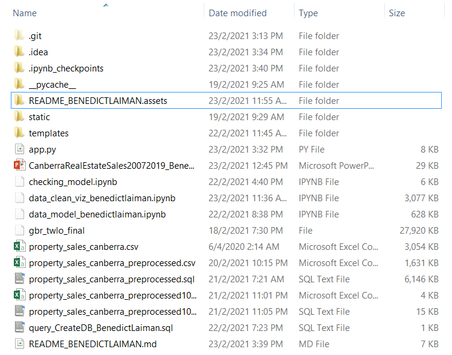
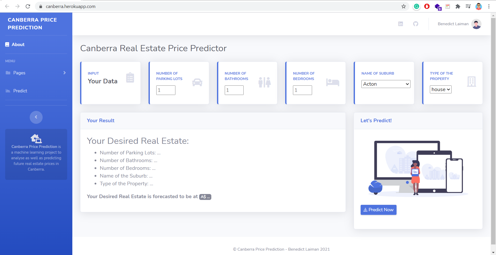
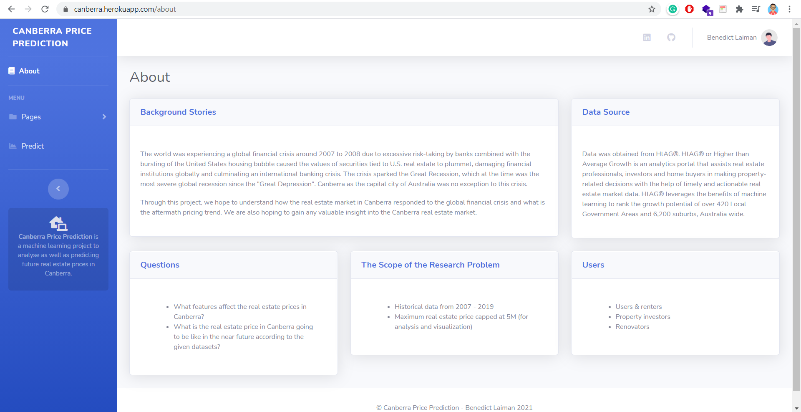
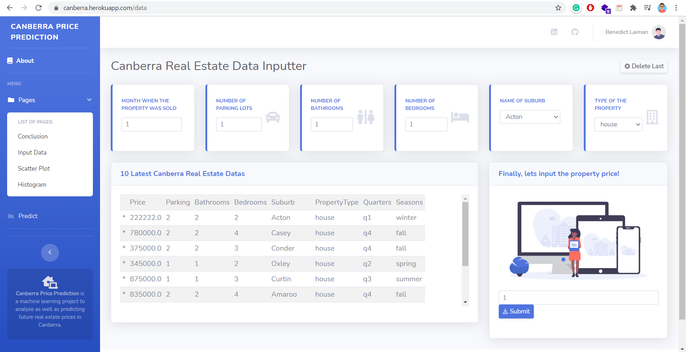
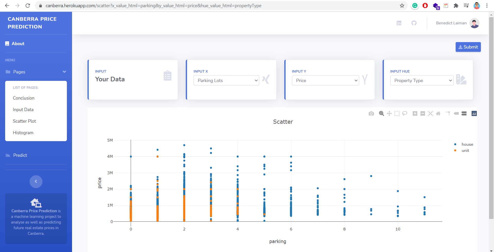
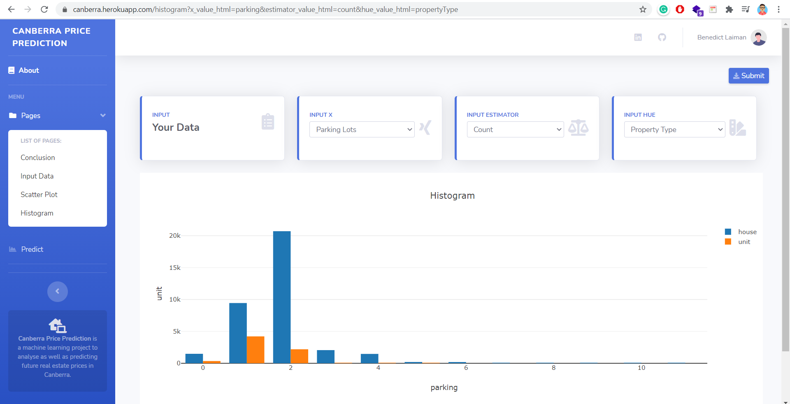
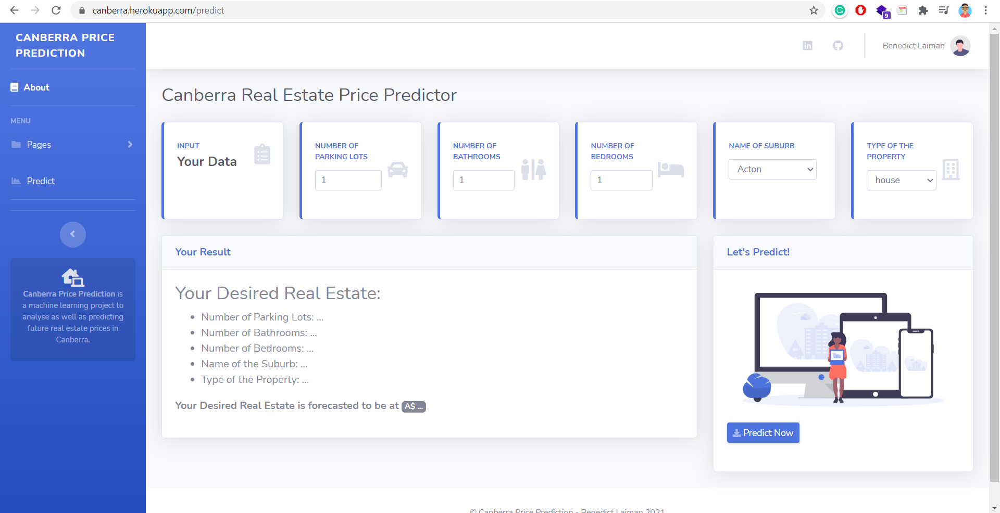

# Canberra Real Estate Sales 2007 - 2019

<hr/>


Photo by [Daniel Morton](https://unsplash.com/@themortz) on [Unsplash](https://unsplash.com/photos/V_pvQ96focY)

## Introduction

Data was obtained from HtAG®. HtAG® or Higher than Average Growth is an analytics portal that assists real estate professionals, investors and home buyers in making property-related decisions with the help of timely and actionable real estate market data. HtAG® leverages the benefits of machine learning to rank the growth potential of over 420 Local Government Areas and 6,200 suburbs, Australia wide.


> #### Background Stories

The world was experiencing a global financial crisis around 2007 to 2008 due to excessive risk-taking by banks combined with the bursting of the United States housing bubble caused the values of securities tied to U.S. real estate to plummet, damaging financial institutions globally and culminating an international banking crisis. The crisis sparked the Great Recession, which at the time was the most severe global recession since the "Great Depression". Canberra as the capital city of Australia was no exception to this crisis.

Through this project, we hope to understand how the real estate market in Canberra responded to the global financial crisis and what is the aftermath pricing trend. We are also hoping to gain any valuable insight into the Canberra real estate market.


> #### Questions

- What features affect the real estate prices in Canberra?
- What is the real estate price in Canberra going to be like in the near future according to the given datasets?


> #### The Scope of the Research Problem

- Historical data from 2007 - 2019
- Maximum real estate price capped at 5M (for analysis and visualization)


> #### Users

- Users & renters
- Property investors
- Renovators

<hr/>

## Github File Descriptions



1. __property_sales_canberra.csv__ --> csv file containing the original data from HtAG

2. **property_sales_canberra_preprocessed.csv** --> csv file that contains all data from "property_sales_canberra.csv" that have been preprocessed. 

3. **property_sales_canberra_preprocessed.sql**  --> sql file that contains all data from "property_sales_canberra.csv" that have been preprocessed. 

4. **property_sales_canberra_preprocessed100.csv**  --> csv file that contains only 100 data from "property_sales_canberra.csv" that have been preprocessed. 

5. **property_sales_canberra_preprocessed100.sql** --> sql file that contains only 100 data from "property_sales_canberra.csv" that have been preprocessed. 

6. **query_CreateDB_BenedictLaiman.sql** --> sql queries to create database for "app.py"

7. **data_clean_viz_benedictlaiman.ipynb** --> ipynb file containing data that have been cleaned, preprocessed, analized, and visualized

8. **data_model_benedictlaiman.ipynb** --> ipynb file containing data modelling process

9. **gbr_twlo_final** --> final machine learning model

10. **checking_model.ipynb** --> ipynb file to check saved machine learning model

11. **app.py** --> python file for dashboard

12. **static** --> folder containing all the dependencies for dashboard

    - **css** --> folder containing css files
    - **img** --> folder containing images/ vector images
    - **js** --> folder containing javascript files
    - **scss**  --> folder containing scss files
    - **vendor** --> folder containing the other dependencies

13. **templates** --> html files for dashboard

    - layout.html
    - login.html
    - home.html
    - about.html
    - conclusion.html
    - data.html
    - table_updated.html
    - histogram.html
    - histogram_result.html
    - predict.html
    - result.html
    - scatter.html
    - scatter_result.html


14. **CanberraRealEstateSales20072019_BenedictLaiman.pptx** --> Presentation file

15. **README_BENEDICTLAIMAN.assets** --> folder containing assets for markdown file

    

<hr/>

## Notes

- **property_sales_canberra_preprocessed vs property_sales_canberra_preprocessed100** --> both of these files are data that have been preprocessed, however, *"property_sales_canberra_preprocessed100"* takes 100 samples from *"property_sales_canberra_preprocessed"*, or in other word, it is a minified version of *"property_sales_canberra_preprocessed"*.

- *Histogram* and *scatter plot diagram* that are shown in the dashboard ("Canberra Price Prediction") use **property_sales_canberra_preprocessed.csv** to speed up the loading process.

- *Table* and *data inputter* in the dashboard use a database from **property_sales_canberra_preprocessed100.sql**.

- *To sync the data* of histogram, scatter plot diagram, table, and data inputter of the dashboard, please activate this syntax (*line 25*) that is located in **"app.py"** file:

  ```python
  df_preprocessed = pd.read_sql("SELECT * FROM property_sales_canberra_preprocessed100.mytable", dbConnection)
  ```

- Use **property_sales_canberra_preprocessed.sql** as the database for the dashboard instead of **property_sales_canberra_preprocessed100.sql** to gain a complete preprocessed dataset.

<hr/>

## Dashboard

Dashboard template by [Start Boostrap](https://startbootstrap.com/theme/sb-admin-2), modified by [Benedict Laiman](https://www.linkedin.com/in/benedict-laiman-60401319a/)

* This dashboard can only be open locally through localhost, it is created with *Flask*, *SQLAlchemy*, and *MySQL*

* Deployed version of this <a href="https://canberra.herokuapp.com/"></a> can be found <a href="https://canberra.herokuapp.com/">***here***</a>, it is created with *Flask*, *SQLAlchemy*, *PostgreSQL*, and *Heroku*

<br>

> #### Home Page



<br>

> #### About Page



<br>

> #### Conclusion Page


<br>

> #### Table & Data Inputter Page



<br>

> #### Scatter Plot Page



<br>

> #### Histogram Page



<br>

> #### Real Estate Price Predictor Page



*This dashboard is a fully responsive website.

<hr/>

## Profile

Get in touch with me through:

- [Linkedin](https://www.linkedin.com/in/benedict-laiman-60401319a/)
- [Discord](https://discordapp.com/users/525654231940857867/)
- [Instagram](https://www.instagram.com/benedictlaiman/)
- [Issuu](https://issuu.com/benedictlaiman/)


