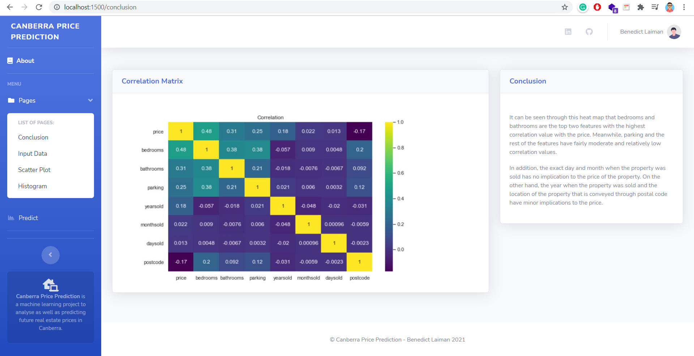
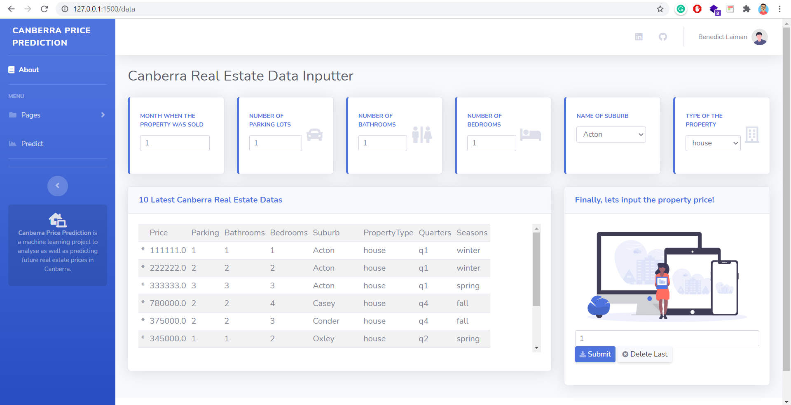
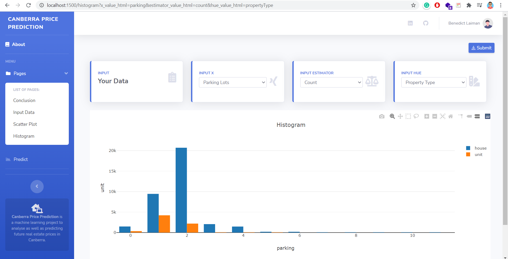

# Canberra Real Estate Sales 2007 - 2019

<hr/>


Photo by [Daniel Morton](https://unsplash.com/@themortz) on [Unsplash](https://unsplash.com/photos/V_pvQ96focY)

## Github File Descriptions


1. __property_sales_canberra.csv__ --> csv file containing the original data from HtAG

2. **property_sales_canberra_preprocessed.csv** --> csv file that contains all data from "property_sales_canberra.csv" that have been preprocessed. 

3. **property_sales_canberra_preprocessed.sql**  --> sql file that contains all data from "property_sales_canberra.csv" that have been preprocessed. 

4. **property_sales_canberra_preprocessed100.csv**  --> csv file that contains only 100 data from "property_sales_canberra.csv" that have been preprocessed. 

5. **property_sales_canberra_preprocessed100.sql** --> sql file that contains only 100 data from "property_sales_canberra.csv" that have been preprocessed. 

6. **query_CreateDB_BenedictLaiman.sql** --> sql queries to create database for "app.py"

7. **data_clean_viz_benedictlaiman.ipynb** --> ipynb file containing data that have been cleaned, preprocessed, analized, and visualized

8. **data_model_benedictlaiman.ipynb** --> ipynb file containing data modelling process

9. **gbr_twlo_final** --> final machine learning model

10. **checking_model.ipynb** --> ipynb file to check saved machine learning model

11. **app.py** --> python file for dashboard

12. **static** --> folder containing all the dependencies for dashboard

    - **css** --> folder containing css files
    - **img** --> folder containing images/ vector images
    - **js** --> folder containing javascript files
    - **scss**  --> folder containing scss files
    - **vendor** --> folder containing the other dependencies

13. **templates** --> html files for dashboard

    - layout.html
    - login.html
    - home.html
    - about.html
    - conclusion.html
    - data.html
    - table_updated.html
    - histogram.html
    - histogram_result.html
    - predict.html
    - result.html
    - scatter.html
    - scatter_result.html


14. **CanberraRealEstateSales20072019_BenedictLaiman.pptx** --> Presentation file

15. **README_BENEDICTLAIMAN.assets** --> folder containing assets for markdown file

    

## Notes

- **property_sales_canberra_preprocessed vs property_sales_canberra_preprocessed100** --> both of these files are data that have been preprocessed, however, *"property_sales_canberra_preprocessed100"* takes 100 samples from *"property_sales_canberra_preprocessed"*, or in other word, it is a minified version of *"property_sales_canberra_preprocessed"*.

- *Histogram* and *scatter plot diagram* that are shown in the dashboard ("Canberra Price Prediction") use **property_sales_canberra_preprocessed.csv** to speed up the loading process.

- *Table* and *data inputter* in the dashboard use a database from **property_sales_canberra_preprocessed100.sql**.

- *To sync the data* of histogram, scatter plot diagram, table, and data inputter of the dashboard, please activate this syntax (*line 25*) that is located in **"app.py"** file:

  ```python
  df_preprocessed = pd.read_sql("SELECT * FROM property_sales_canberra_preprocessed100.mytable", dbConnection)
  ```

- Use **property_sales_canberra_preprocessed.sql** as the database for the dashboard instead of **property_sales_canberra_preprocessed100.sql** to gain a complete preprocessed dataset.

## Dataset:

Data were obtained from HtAG®. HtAG® or Higher than Average Growth is an analytics portal that assists real estate professionals, investors and home buyers in making property-related decisions with the help of timely and actionable real estate market data. HtAG® leverages the benefits of machine learning to rank the growth potential of over 420 Local Government Areas and 6,200 suburbs, Australia wide.

Column Descriptions

- datesold = date when the property was sold
- price = price of the property when it was sold
- suburb = suburbs in Canberra, Australia
- postcode = postal code of a place
- lat = latitude of the location
- lon = longitude of the location
- parking = number of parking lots
- bathrooms = number of bathrooms
- bedrooms = number of bedrooms
- propertyType = type of the property
- suburbid = the id of the suburbs

## Introduction

The aim of this project is to conduct exploratory data analysis and reduce overpricing and underpricing by creating a regression-based machine learning model that predicts real estate prices in the Canberra district.


The selected metric for this project is MAE (Mean Absolute Error) due to the presence of a highly skewed distribution of monetary values, including numerous outliers. MAE is a robust metric when dealing with such outliers.


> #### The scope of the research problem includes:

- Historical data spanning from 2007 to 2019.
- A maximum limit set at 5 million for real estate prices (for analysis and visualization purposes).


> #### This project caters to the following user groups:
- Prospective buyers and renters

- Property investors

- Individuals interested in renovation opportunities


## Some Findings:

- The most effective algorithm employed is the **Gradient Boost Regressor Tuned**, optimized through hyperparameter tuning (including max_depth, n_estimators, and loss function) and the removal of outliers. It achieved a mean neg_mean_absolute_error of -107,049.269 during several cross-validation runs.

- Over the period from 2007 to 2019, **house prices** in Canberra consistently demonstrated an upward trend, steadily increasing throughout this duration. Conversely, **unit prices** exhibited fluctuations and remained relatively stable compared to their initial values.

- Analysis of **sales across quarters** (q1, q2, q3, q4) throughout the observed period revealed consistent patterns, with no significant differences (as confirmed by the Kruskal-Wallis Test). However, when **considering seasons**, it becomes apparent that real estate sales during the winter season tended to be lower compared to other seasons.

- etc (Please check out the "data_clean_viz_benedictlaiman.ipynb" file :D )


## Dashboard

Dashboard template by [Start Boostrap](https://startbootstrap.com/theme/sb-admin-2), modified by [Benedict Laiman](https://www.linkedin.com/in/benedict-laiman-60401319a/)

* This dashboard can only be open locally through localhost, it is created with *Flask*, *SQLAlchemy*, and *MySQL*

* Deployed version of this <a href="https://canberra.herokuapp.com/"></a> can be found <a href="https://canberra.herokuapp.com/">***here***</a>, it is created with *Flask*, *SQLAlchemy*, *PostgreSQL*, and *Heroku*

<br>

> #### Home Page


<br>

> #### About Page


<br>

> #### Conclusion Page



<br>

> #### Table & Data Inputter Page



<br>

> #### Scatter Plot Page


<br>

> #### Histogram Page



<br>

> #### Real Estate Price Predictor Page


*This dashboard is a fully responsive website.

<hr/>

## Profile


- [Discord](https://discordapp.com/users/525654231940857867/)


